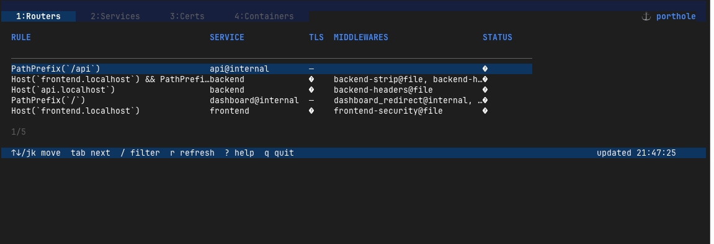

# ⚓ porthole

A terminal dashboard for [Traefik](https://traefik.io/) — inspect routers, services, TLS certificates, and Docker containers in real time.



```text
 1:Routers   2:Services   3:Certs   4:Containers               ⚓ porthole
┌──────────────────────────────────────────────────────────────────────────┐
│ RULE                                    SERVICE              TLS   STATUS │
│──────────────────────────────────────────────────────────────────────────│
│ Host(`api.example.com`)                 api-service@docker    ✓   enabled │
│ Host(`app.example.com`) && PathPre...   frontend@docker       ✓   enabled │
│ Host(`admin.example.com`)               admin@docker          ✓   enabled │
│ Host(`metrics.example.com`)             prometheus@docker     —   enabled │
│ Host(`old.example.com`)                 legacy@docker         ✓  disabled │
│                                                                           │
│                                                                           │
└──────────────────────────────────────────────────────────────────────────┘
  ↑↓/jk move  tab next  / filter  r refresh  ? help  q quit   updated 14:23:01
```

## Features

- **Routers** — routing rules, TLS status, attached middlewares, and enabled/disabled state
- **Services** — backend service names, type (load balancer / etc.), and upstream server URLs
- **Certs** — TLS certificate domains, issuer, expiry date, and colour-coded remaining days
- **Containers** — Docker container state, image, uptime, and restart count with warning highlights
- **Live polling** — data refreshes on a configurable interval (default 5 s); press `r` to force
- **Inline filter** — press `/` and type to filter any table by any column value
- **Help overlay** — press `?` for a full keybindings reference

## Installation

### Pre-built binaries

Download the latest release for your platform from the [Releases](https://github.com/kjaniec-dev/porthole/releases) page, then place the binary on your `$PATH`.

### Build from source

```sh
git clone https://github.com/kjaniec-dev/porthole.git
cd porthole
go build -o porthole ./cmd/porthole
```

Requires **Go 1.25+**.

## Configuration

Copy the example config and edit it:

```sh
cp .porthole.yaml.example .porthole.yaml
```

`.porthole.yaml`:

```yaml
traefik:
  url: http://127.0.0.1:8080   # Traefik API endpoint
  poll_interval: 5s
  # username: admin            # optional HTTP basic auth
  # password: secret

docker:
  socket: /var/run/docker.sock
```

Porthole looks for `.porthole.yaml` in the current directory, `$HOME`, or any standard config path recognised by [Viper](https://github.com/spf13/viper).

## Usage

```sh
porthole
```

## Local Demo

A self-contained demo stack lives in `examples/local-stack/`. It runs:

- Traefik with the dashboard/API on `http://127.0.0.1:8080`
- a React frontend on `https://frontend.localhost`
- a Python backend on `https://api.localhost`
- a local TLS certificate so the Certs tab has real data

Start the stack:

```sh
docker compose -f examples/local-stack/compose.yaml up --build
```

Point `porthole` at the demo:

```sh
cp examples/local-stack/.porthole.yaml.example .porthole.yaml
./porthole
```

See [examples/local-stack/README.md](examples/local-stack/README.md) for the full walkthrough.

### Keybindings

| Key | Action |
|-----|--------|
| `tab` / `shift+tab` | Next / previous tab |
| `1` `2` `3` `4` | Jump directly to a tab |
| `j` / `k` / `↑` `↓` | Move selection up / down |
| `/` | Open inline filter (type to search, `Enter`/`Esc` to close) |
| `Esc` | Clear filter / close overlays |
| `r` | Force data refresh |
| `?` | Toggle help overlay |
| `q` / `ctrl+c` | Quit |

### Certificate expiry colours

| Colour | Meaning |
|--------|---------|
| Green | > 90 days remaining |
| Yellow | 30–90 days remaining |
| Red | < 30 days or already expired |

## Requirements

- Traefik v2/v3 with the [API enabled](https://doc.traefik.io/traefik/operations/api/) (`api.insecure: true` or authenticated)
- Docker socket access (optional — the Containers tab is skipped if unavailable)
- A true-colour terminal for the best experience

## License

MIT
